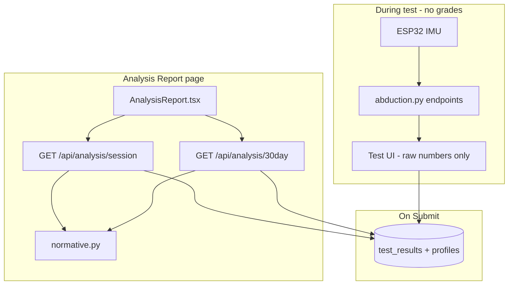

# Profile-Based Assessment Update — Technical Reference

This document describes the **dynamic, profile-aware assessment** update to STRYDE. It explains what changed, why it changed, how each piece works, and where to find the code. It is intended for developers maintaining the project or reviewing the architecture.

**Related docs:** `context/30_day_analysis.md` (longitudinal regression only), `context/backend_structure.md` (Supabase schema), `context/initial_description.md` (original hardcoded thresholds — now superseded for scoring).

---

## 1. Problem Statement: What Was Wrong Before

### 1.1 Universal (hardcoded) thresholds

Previously, test quality was judged with **fixed numbers for every user**, regardless of age, sex/gender, activity level, or injury status. These rules were documented in `context/initial_description.md`:

| Test | Old rule (everyone) |
|------|---------------------|
| ROM | ≥150° Excellent, ≥90° Moderate, &lt;90° Needs Improvement |
| Stability | SD &lt;2° Very Stable, ≤4° Stable, &gt;4° Unstable |
| Speed | ≥18 reps Excellent, 10–17 Good, &lt;10 Needs Attention |
| Speed consistency | &lt;0.5s Very Consistent, 0.5–1.0s Consistent, &gt;1.0s Inconsistent |

**Why this is a problem:**

- A 65-year-old in post-operative rehab and a 22-year-old athlete were graded on the same “Excellent” bar (e.g. 150° ROM, 18 reps in 30s).
- That produces **false negatives** (discouraging legitimate progress) and **false positives** (calling mediocre performance “Excellent” for someone who should be held to a higher bar).
- Profile data was already collected in onboarding (`profiles.age`, `gender`, `activity_level`, `has_injury`) but was only passed into the **Groq AI narrative** for the 30-day report—not into numeric grading.

### 1.2 Assessment shown during the test

The live test UI (`AbductionAdduction.tsx`) showed colored badges (“Excellent”, “Very Stable”, etc.) **while or immediately after recording**, using the same fixed cutoffs. That mixed **data capture** with **clinical interpretation**, and encouraged users to treat live labels as final scores before data was saved or contextualized.

### 1.3 Prediction target was fixed at 150°

`compute_predicted_recovery` always extrapolated toward **150°** full abduction, even when the user’s profile suggested a different realistic target (e.g. after injury).

---

## 2. Design Goals of the Update

| Goal | Approach |
|------|----------|
| **Personalized “ideal” benchmarks** | Derive expected ROM, stability SD, and speed reps from `profiles` |
| **Separate capture vs interpretation** | Recording UI shows raw metrics + “Recorded”; grades appear on **Analysis Report** |
| **Two complementary report tracks** | (A) Latest session vs profile norms; (B) 30-day linear regression (unchanged in spirit, enhanced with dynamic chart lines) |
| **Single source of truth for scoring** | New module `backend/normative.py`; both `/session` and `/30day` call it |
| **Backward-compatible storage** | `test_results` JSONB still stores raw sensor payloads; assessments are computed at report time (not baked into DB on submit) |

---

## 3. High-Level Architecture (After)



**Intra-user vs inter-user analysis:**

- **Track 1 — Profile-based assessment:** “How did my *latest* session compare to what we expect for *someone like me*?”
- **Track 2 — 30-day progress:** “How has my ROM changed over time?” (linear regression, consistency index, stability delta, AI text — see `context/30_day_analysis.md`).

---

## 4. Backend: `normative.py` (New Module)

**File:** `backend/normative.py`

This is the **core intelligence** for numeric grading. It does not call external ML APIs; it applies transparent, configurable rules based on profile fields.

### 4.1 Activity-level speed tables

Speed expectations scale with `activity_level` from onboarding:

```9:15:backend/normative.py
ACTIVITY_SPEED = {
    'sedentary': {'excellent': 10, 'good': 6, 'consistency_excellent': 0.6, 'consistency_good': 1.1},
    'light': {'excellent': 12, 'good': 8, 'consistency_excellent': 0.55, 'consistency_good': 1.0},
    'moderate': {'excellent': 15, 'good': 10, 'consistency_excellent': 0.5, 'consistency_good': 1.0},
    'active': {'excellent': 18, 'good': 12, 'consistency_excellent': 0.45, 'consistency_good': 0.9},
    'athlete': {'excellent': 22, 'good': 15, 'consistency_excellent': 0.4, 'consistency_good': 0.85},
}
```

**Why:** Rep count in 30 seconds is strongly tied to fitness and training background. The old global “≥18 Excellent” maps only to the `active` tier here.

### 4.2 `get_normative_targets(profile)` — building the “ideal person” for this user

```24:94:backend/normative.py
def get_normative_targets(profile: Optional[Dict[str, Any]] = None) -> Dict[str, Any]:
    """
    Compute expected performance targets for a user profile.
    Returns thresholds used for tiered assessment and chart reference lines.
    """
    profile = profile or {}
    age = int(profile.get('age') or 30)
    gender = (profile.get('gender') or 'other').lower()
    activity = (profile.get('activity_level') or DEFAULT_ACTIVITY).lower()
    has_injury = bool(profile.get('has_injury'))
    ...
    # Base ROM (healthy adult reference, degrees)
    rom_excellent = 150.0
    rom_moderate = 90.0
    ...
    # Age: gradual decline after 30 (~0.35°/year on excellent threshold)
    if age > 30:
        age_penalty = (age - 30) * 0.35
        rom_excellent -= age_penalty
        ...
    # Gender: small population norm differences
    if gender == 'female':
        rom_excellent -= 3.0
        rom_moderate -= 2.0
    ...
    # Injury / rehab: lower expectations (~25% ROM, ~20% speed)
    injury_factor_rom = 0.72 if has_injury else 1.0
    injury_factor_speed = 0.80 if has_injury else 1.0
    ...
```

**Adjustment summary:**

| Factor | Effect on ROM | Effect on speed | Effect on stability SD |
|--------|---------------|-----------------|-------------------------|
| Age &gt; 30 | −0.35°/year from excellent; partial reduction on moderate/full | — | — |
| Female | −3° excellent, −2° moderate | — | — |
| Other gender | −1.5° excellent | — | — |
| `has_injury` | ×0.72 on ROM thresholds | ×0.80 on rep targets | Excellent ≤2.8°, moderate ≤5.0° (vs 2° / 4°) |

Values are **clamped** so targets stay physiologically plausible (e.g. ROM excellent not below 55°).

**Returned object** includes everything the API and charts need: `rom_excellent`, `rom_moderate`, `rom_full_abduction`, `speed_excellent_reps`, `speed_good_reps`, consistency thresholds, stability SD thresholds, and `profile_summary` for UI copy.

### 4.3 Tier helpers — comparing actuals to targets

**ROM** — higher angle is better:

```97:116:backend/normative.py
def _tier_rom(value: float, norms: Dict[str, Any]) -> Dict[str, Any]:
    excellent = norms['rom_excellent']
    moderate = norms['rom_moderate']
    if value >= excellent:
        tier, label, color = 'excellent', 'Excellent', 'green'
    elif value >= moderate:
        tier, label, color = 'moderate', 'Moderate', 'orange'
    else:
        tier, label, color = 'needs_improvement', 'Needs Improvement', 'red'

    pct = min(100.0, round((value / excellent) * 100, 1)) if excellent > 0 else 0.0
    return {
        'value': round(value, 1),
        ...
        'percent_of_ideal': pct,
        'expected_excellent': excellent,
        'expected_moderate': moderate,
    }
```

**Stability** — lower average hold SD is better; `percent_of_ideal` uses inverted logic (`excellent_sd / avg_sd`):

```119:143:backend/normative.py
def _tier_stability(avg_sd: float, norms: Dict[str, Any]) -> Dict[str, Any]:
    exc = norms['stability_excellent_sd']
    mod = norms['stability_moderate_sd']
    if avg_sd < exc:
        tier, label, color = 'excellent', 'Very Stable', 'green'
    ...
```

**Speed** — rep count tiers plus optional consistency sub-score:

```146:184:backend/normative.py
def _tier_speed(reps: int, consistency: Optional[float], norms: Dict[str, Any]) -> Dict[str, Any]:
    exc = norms['speed_excellent_reps']
    good = norms['speed_good_reps']
    ...
```

### 4.4 `extract_session_metrics(row)` — from Supabase JSONB

Reads one `test_results` row and produces a flat dict for scoring:

```186:217:backend/normative.py
def extract_session_metrics(row: Dict[str, Any]) -> Optional[Dict[str, Any]]:
    """Pull measurable values from a test_results row."""
    rom = row.get('rom_data') or {}
    ...
    peak_rom = rom.get('maxRoll')
    if peak_rom is None:
        return None
    ...
    avg_sd = sum(phase_sds) / len(phase_sds) if phase_sds else None

    return {
        'peak_rom': float(peak_rom),
        'reps': reps,
        'rep_consistency': consistency,
        'avg_sd': avg_sd,
        'phase_sds': phase_sds,
    }
```

**Why ROM is required:** Without `maxRoll`, regression and session assessment cannot run; rows missing ROM are skipped.

### 4.5 `assess_session(metrics, profile)` — overall grade

```220:256:backend/normative.py
def assess_session(metrics: Dict[str, Any], profile: Optional[Dict[str, Any]] = None) -> Dict[str, Any]:
    norms = get_normative_targets(profile)
    rom = _tier_rom(metrics['peak_rom'], norms)
    stability = _tier_stability(metrics['avg_sd'], norms) if metrics.get('avg_sd') is not None else None
    speed = _tier_speed(metrics['reps'], metrics.get('rep_consistency'), norms)
    ...
    if excellent_count == len(tiers):
        overall_label = 'Excellent'
    elif all(t in ('excellent', 'moderate') for t in tiers):
        overall_label = 'Good'
    else:
        overall_label = 'Needs Improvement'
```

**Overall rule:** All metrics excellent → Excellent; all excellent or moderate → Good; any `needs_improvement` → Needs Improvement.

---

## 5. Backend: `analysis.py` Changes

### 5.1 Import and shared Supabase helpers

```python
from normative import get_normative_targets, extract_session_metrics, assess_session
```

`fetch_profile` and `fetch_latest_test_result` centralize authenticated REST reads to Supabase (same pattern as the existing 30-day endpoint — avoids `supabase-py` RLS token issues documented in `context/30_day_analysis.md`):

```484:511:backend/analysis.py
def fetch_profile(user_id: str) -> dict:
    headers = _supabase_headers()
    profile_url = (
        f"{_supabase_url}/rest/v1/profiles"
        f"?id=eq.{user_id}"
        f"&select=age,gender,activity_level,has_injury,injury_notes,height_cm,weight_kg"
    )
    ...

def fetch_latest_test_result(user_id: str, test_type: str, side: str):
    ...
    params = {
        'user_id': f'eq.{user_id}',
        'test_type': f'eq.{test_type}',
        'side': f'eq.{side}',
        'order': 'created_at.desc',
        'limit': '1',
        ...
    }
```

### 5.2 New endpoint: `GET /api/analysis/session`

**Purpose:** Assess the **most recent** saved test for `(user_id, test_type, side)` against profile norms. Works with **one** submitted session (no 3-session minimum).

```544:576:backend/analysis.py
@analysis_bp.route('/api/analysis/session')
def analysis_session():
    """
    GET /api/analysis/session?user_id=&test_type=&side=
  Profile-aware assessment of the most recent test session vs normative targets.
    """
    ...
    profile = fetch_profile(user_id)
    row = fetch_latest_test_result(user_id, test_type, side)
    ...
    metrics = extract_session_metrics(row)
    assessment = assess_session(metrics, profile)
```

**Response shape (success):**

- `session_assessment` — output of `assess_session`
- `session_metrics` — raw numbers used
- `session_meta` — date, test type, side
- `normative_targets` — thresholds for UI/chart

**Soft errors (HTTP 200):** `no_session`, `invalid_session` with human-readable `message` so the frontend can guide the user to complete a test first.

Registered in `backend/server.py`:

```108:109:backend/server.py
    print("  GET  /api/analysis/30day   <- 30-day progress report")
    print("  GET  /api/analysis/session <- profile-based session assessment")
```

### 5.3 Enhanced endpoint: `GET /api/analysis/30day`

**Dynamic recovery target:**

```668:717:backend/analysis.py
        profile = fetch_profile(user_id)
        norms = get_normative_targets(profile)
        target_rom = norms['rom_full_abduction']
        ...
        predicted_recovery = compute_predicted_recovery(
            recovery_slope, consistency_index, target_rom=target_rom
        )
```

`compute_predicted_recovery` accepts optional `target_rom` (defaults to 150 if omitted):

```252:260:backend/analysis.py
def compute_predicted_recovery(recovery_slope, consistency_index, target_rom=None):
    ...
    if target_rom is None:
        target_rom = 150
```

**Session assessment on latest row in the 30-day window:**

```719:734:backend/analysis.py
        session_assessment = None
        session_meta = None
        if rows:
            latest_row = rows[-1]
            latest_metrics = extract_session_metrics(latest_row)
            if latest_metrics:
                session_assessment = assess_session(latest_metrics, profile)
```

**Personalized chart reference lines** embedded in `chart_data`:

```738:747:backend/analysis.py
        chart_data = {
            ...
            'reference_rom_excellent': norms['rom_excellent'],
            'reference_rom_moderate': norms['rom_moderate'],
            'reference_speed_excellent': norms['speed_excellent_reps'],
        }
```

**Full response** now includes `normative_targets`, `session_assessment`, and `session_meta`:

```756:776:backend/analysis.py
        response = {
            'recovery_slope': recovery_slope,
            ...
            'normative_targets': norms,
            'session_assessment': session_assessment,
            'session_meta': session_meta,
            'meta': { ... }
        }
```

**Unchanged:** Still requires **≥3 valid sessions** in the last 30 days for regression/AI blocks; returns `error: insufficient_data` otherwise. The frontend uses `/session` so users with 1–2 tests still get normative scoring.

---

## 6. Backend: `abduction.py` — Raw Data Only on `/data/rom`

Assessment fields were **removed** from the live ROM endpoint. It now returns trajectories and `maxRoll` only:

```209:218:backend/abduction.py
        return {
            "status": "ok",
            "times": times,
            "rolls": rolls,
            "maxIdx": max_idx,
            "maxTime": times[max_idx],
            "maxRoll": max_roll,
            "baseline": rom_baseline if rom_baseline_set else 0,
            "baselineSet": rom_baseline_set,
        }
```

**Removed:** `assessment`, `assessmentColor`, `referenceRanges` (fixed 90° / 150° / 180°). Interpretation is no longer the responsibility of the real-time test API.

Stability and speed endpoints were already returning raw phase/rep data; grading was previously done in the frontend with hardcoded comparisons — that logic was removed from the UI (see §7).

---

## 7. Frontend: Test Recording (`AbductionAdduction.tsx`)

### 7.1 Submit strips legacy assessment fields

Even if old backend versions added `assessment` to ROM JSON, submit **omits** them before insert:

```270:280:frontend-react/src/pages/tests/AbductionAdduction.tsx
            const { assessment: _a, assessmentColor: _c, ...romPayload } = romData;

            const { error } = await supabase.from('test_results').insert([
                {
                    user_id: user.id,
                    test_type: 'Arm - Abduction & Adduction',
                    side: side,
                    rom_data: romPayload,
                    stability_data: stabilityData,
                    speed_data: speedData
                }
            ]);
```

**Why:** Keeps `test_results` as a **pure sensor record**; scores are always derived from current `normative.py` rules when the report runs.

### 7.2 UI during/after recording

- **`RecordedBadge`** — confirms capture without grading:

```211:228:frontend-react/src/pages/tests/AbductionAdduction.tsx
function RecordedBadge() {
    ...
            <span style={{ fontWeight: 600, fontSize: '0.9rem', color: '#166534' }}>Recorded</span>
            <span style={{ fontSize: '0.8rem', color: '#6b7280' }}>
                Data captured for this test. Profile-based analysis is available on the dashboard.
            </span>
```

- **Speed / stability completion panels** — titles like “Speed Test — Recorded” with **numeric** reps, consistency SD, and per-phase std dev only (no “Excellent” / “Unstable” badges).
- **No live ROM assessment banner** (previously compared to 150° / 90°).

Mechanical test flow is unchanged: ROM → stability (needs ROM max for 4th angle) → speed → submit.

---

## 8. Frontend: Analysis Report (`AnalysisReport.tsx`)

### 8.1 Parallel API calls

`generateReport` fetches both endpoints at once:

```205:208:frontend-react/src/pages/AnalysisReport.tsx
            const [sessionRes, progressRes] = await Promise.all([
                fetch(`${base}/session?${qs}`, { headers }),
                fetch(`${base}/30day?${qs}`, { headers }),
            ]);
```

**State:**

- `sessionData` — normative block (from `/session`)
- `data` — 30-day block (from `/30day`, may be absent)
- `progressNote` — non-fatal message when &lt;3 sessions but session assessment still shown

```222:226:frontend-react/src/pages/AnalysisReport.tsx
            if (progressJson.error === 'insufficient_data') {
                setProgressNote(
                    progressJson.message ||
                    `30-day progress needs at least 3 sessions (found ${progressJson.record_count || 0}). Normative assessment below uses your latest test.`
                );
```

### 8.2 Track 1 UI: `renderNormativeSection()`

```263:345:frontend-react/src/pages/AnalysisReport.tsx
    const renderNormativeSection = () => {
        if (!assessmentSource) return null;
        ...
                    <h2 ...>Profile-Based Assessment</h2>
                ...
                    Compared to expected performance for your profile
                    {profile ? ` (age ${profile.age}, ${profile.gender}, ...` : ''}.
        ...
                    {renderMetricCard('Range of Motion', `${a.rom.value}°`, `≥${a.rom.expected_excellent}° excellent ...`, a.rom)}
                    ...
```

Each card shows:

- Tier label (Excellent / Moderate / etc.)
- **You:** actual measurement
- **Profile target:** personalized thresholds
- **% of ideal** — ROM and speed use `value/target`; stability uses inverted SD logic from backend

Rendered **above** the 30-day section when both exist:

```808:834:frontend-react/src/pages/AnalysisReport.tsx
                    <div ref={targetRef} className="analysis-results" ...>
                        {renderNormativeSection()}

                        {data && (
                            <>
                                <div ...>
                                    <h2 ...>30-Day Progress: ...</h2>
```

### 8.3 Track 2 UI: chart uses dynamic reference lines

```348:352:frontend-react/src/pages/AnalysisReport.tsx
        const romExcellent = cd.reference_rom_excellent ?? norms?.rom_excellent ?? 150;
        const romModerate = cd.reference_rom_moderate ?? norms?.rom_moderate ?? 90;
```

Chart annotations label lines as **“Your excellent target”** and **“Your moderate target”** instead of fixed 90° / 150°. Rep bar colors use `reference_speed_excellent` from the backend when present.

Track 2 otherwise matches the prior 30-day report: recovery slope, consistency index, stability delta, predicted recovery, Groq AI insights (see `context/30_day_analysis.md`).

---

## 9. Frontend: Dashboard History (`TestRecordCard.tsx`)

Historical cards show **numbers only** — no embedded assessment strings:

```141:148:frontend-react/src/components/TestRecordCard.tsx
                    <div style={{ background: '#f9fafb', ... }}>
                        <div style={{ fontSize: '0.8rem', color: '#666' }}>Max ROM</div>
                        <div style={{ fontWeight: 'bold', fontSize: '1.1rem' }}>{romData?.maxRoll?.toFixed(0) || '-'}°</div>
                    </div>
                    ...
                        <div style={{ fontWeight: 'bold', fontSize: '1.1rem' }}>{speedData?.speedTotalReps || 0}</div>
```

Stability expanded view shows SD per phase without “Very Stable” chips.

**Why:** Old records may still contain `rom_data.assessment` from before the update; the UI no longer displays stale hardcoded grades. Users are directed to **Get Analysis Report** for current interpretation.

---

## 10. Profile Fields Used (Supabase `profiles`)

| Column | Used in `normative.py` | Notes |
|--------|------------------------|--------|
| `age` | Yes | Default 30 if missing |
| `gender` | Yes | `male` / `female` / `other` |
| `activity_level` | Yes | Speed rep and consistency tables |
| `has_injury` | Yes | Lowers ROM/speed targets; relaxes stability SD |
| `injury_notes` | No (scoring) | Still sent to Groq in 30-day AI prompt |
| `height_cm`, `weight_kg` | Fetched, not used in norms yet | Reserved for future BMI/adjustments |

Ensure onboarding completes so `profiles` rows exist before generating reports.

---

## 11. API Quick Reference

| Method | Path | Min sessions | Returns |
|--------|------|--------------|---------|
| GET | `/api/analysis/session?user_id=&test_type=&side=` | 1 submitted test | `session_assessment`, `normative_targets`, `session_meta` |
| GET | `/api/analysis/30day?user_id=&test_type=&side=` | 3 valid ROM sessions / 30d | Regression, AI, chart + `session_assessment` on latest row |

**Auth:** `Authorization: Bearer <supabase_access_token>` (same as before).

---

## 12. Example: Same ROM, Different Profiles

Peak ROM **95°** in a session:

| Profile | Approx. `rom_excellent` | Tier at 95° |
|---------|-------------------------|-------------|
| 25yo, active, no injury | ~150° | Needs Improvement |
| 65yo, sedentary, `has_injury` | ~97° | Moderate (≈98% of ideal) |

This illustrates **why** personalization matters: 95° is poor for a young active user but reasonable for an older injured user in rehab.

---

## 13. What Was Deliberately Not Changed

- **IMU acquisition, test choreography, rep detection, stability phases** — unchanged in `abduction.py` collection loop.
- **30-day ML formulas** (`numpy.polyfit` slope, consistency index, stability delta) — same algorithms; only inputs to prediction and chart annotations gained profile awareness.
- **Groq AI prompt structure** — still receives profile text; per-session hardcoded `assessment` strings in the trend log may still appear from legacy DB rows but new submits do not write them.
- **Other test types** in the Analysis Report dropdown — normative tables are built for abduction-style metrics; other movements need their own norm tables if enabled later.

---

## 14. Files Touched (Checklist)

| File | Change |
|------|--------|
| `backend/normative.py` | **New** — all scoring logic |
| `backend/analysis.py` | `/session`, shared fetchers, 30-day enhancements |
| `backend/abduction.py` | ROM endpoint raw-only |
| `backend/server.py` | Log new route |
| `frontend-react/src/pages/AnalysisReport.tsx` | Dual-track report UI |
| `frontend-react/src/pages/tests/AbductionAdduction.tsx` | No live grades; raw post-test panels |
| `frontend-react/src/components/TestRecordCard.tsx` | Metrics only in history |

---

## 15. Operational Notes

1. **Restart backend** after pulling so `normative` is imported and `/api/analysis/session` is registered.
2. **Complete onboarding** so profile fields exist.
3. **Submit at least one test** before expecting the normative section.
4. For full 30-day charts, complete **three** sessions within 30 days on the same `test_type` and `side`.

---

## 16. Possible Future Extensions

- Literature-based or cohort-percentile tables instead of hand-tuned constants in `ACTIVITY_SPEED` and age penalties.
- Per–test-type normative modules (flexion, rotation, etc.).
- Store computed `session_assessment` snapshot on submit for audit trail (optional; currently recomputed on read for always-current rules).
- Use `height_cm` / `weight_kg` or `injury_notes` NLP for finer rehab targets.

---

*Document version: matches profile-based assessment update (dynamic norms + deferred grading on Analysis Report).*
